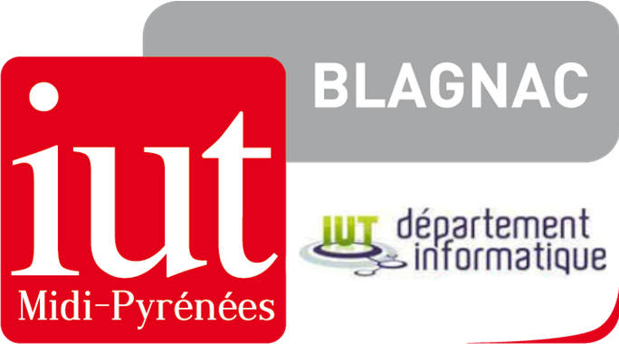
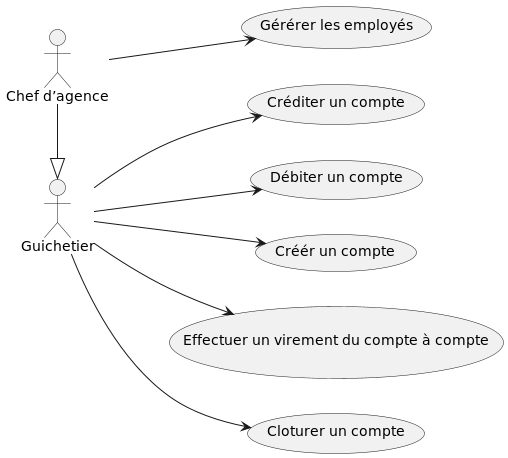

= *Cahier des Charges - SAÉ 2.01/2.05*
:toc:
:toc-title: Sommaire
:title-page:
:sectnums:
:title-logo-image: image:img/Logo_IUT_Blagnac.png[]
:stem: asciimath

.Equipe :  

. Tanguy Picuira
. Emilien Fieu
. Vincent Barette

Version 2.0, 16 Mai 2023, Groupe 3B1

== Daily Bank

=== Présentation du sujet

Le sujet répond à la gestion des comptes bancaires, et des employés.
Une partie est déjà existante, le reste va devoir être développé.

___

==== Contexte

Le secteur bancaire doit s'adapter aux avancées technologiques en augmentant ses investissements dans la numérisation pour reconstruire ses services. En effet, la plupart de ces services devraient être accessibles à distance via des sites Web ou des applications, afin d'améliorer l'accessibilité et l'intérêt de ses clients. 

Les banques doivent innover pour établir un avantage concurrentiel sur le marché, et la pandémie de Covid-19 a renforcé cette nécessité en habituant les clients à tout faire à distance, ce qui a entraîné l'entrée de nouveaux concurrents tels que les Néobanques. Ainsi, pour rester compétitives, les banques doivent fournir des services numériques efficaces pour répondre aux besoins des clients.

___

==== Point de vue Client

Dans cette optique, le réseau bancaire français DailyBank, qui compte plus de 100 agences bancaire, souhaite développer une application JAVA-Oracle pour gérer les comptes clients et remplacer plusieurs outils obsolètes. La restructuration du réseau est nécessaire pour s'adapter à cette stratégie de différenciation sur un marché en constante expansion. Les besoins bancaires et des clients évoluent, ce qui nécessite le développement de multiples fonctionnalités pour répondre à ces besoins.

== Analyse de l'existant

Aujourd'hui, la Version 0 de DailyBank permet :

* De modifier les informations d’un client
* De créer un nouveau client
* De consulter un compte
* De débiter un compte
* De rendre un compte inactif

.UseCase de la Version 0 de l’application DailyBank
image::../img/usecasev0.svg[]

== Analyse des besoins

.UseCase de la Version 1 de l’application DailyBank

.*Version 0*
****
.*Guichetier :*
** Le guichetier peut modifier les informations d'un client.
** Le guichetier peut créer un nouveau client.
** Le guichetier peut consulter un compte bancaire.
** Le guichetier peut débiter un compte bancaire.

.*Chef d'agence :*

** Le Chef d'Agence peut rendre inactif un compte bancaire.
** Le Chef d'Agence *est* un guichetier.
****

.*Version 1*
****
Les besoins de la version précédente, et :

.*Guichetier :*

** Le guichetier peut débiter un compte à travers une base de données.
** Le guichetier peut créer un compte bancaire.
** Le guichetier peut effectuer un virement d'un compte bancaire à l'autre.
** Le guichetier peut clôturer un compte bancaire.

.*Chef d'agence :*

** Le Chef d'Agence peut gérer les guichetiers. _Cela signifie qu'il peut effectuer les actions suivantes :_
*** Créer
*** Consulter
*** Modifier
*** Supprimer
****

== Contraintes

=== Contraintes techniques

Le projet doit être réalisé avec les languages de programmation Java et SQL. Une base de données Oracle est utilisée.

JavaFX est utilisé pour la création d'interfaces graphiques.

La documentation doit être réalisé en AsciiDoc.

Le Gantt doit être fournis au format PDF.

=== Contraintes organisationnelles

Le projet doit être réalisé avant le *mardi 16 mai 17h*, par une équipe de 3 personnes.

.*Semaine 19*
* Première version du cahier des charges en asciidoc
* Première version du GANTT en PDF

.*Semaine 20*
* Deuxième version du cahier des charges en asciidoc
* Deuxième version du GANTT en PDF
* Vérification du GANTT de la première semaine
* Première version du document *technique* et du document *utilisateur*
* Première version du cahier des tests
* Première version du JAR

.*Semaine 21*
* Vérification du GANTT de la deuxième semaine
* Deuxième version du document *technique* et du document *utilisateur*
* Chiffrage du projet
* Deuxième version du JAR
* Deuxième version du cahier des tests & recette finale

.*Semaine 22*
* Soutenance orale
* Evaluation individuelle

.*Semaine 23*
* Evaluation individuelle
