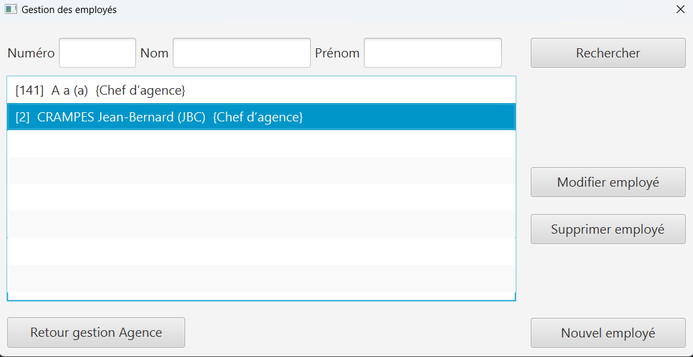

= *Document Technique - SAÉ 2.01/2.05*
:toc:
:toc-position: preamble
:toc-title: Sommaire
:title-page:
:sectnums:
:stem: asciimath

* Tanguy Picuira
* Emilien Fieu
* Vincent Barette

Version 2.0, 26 Mai 2023, Groupe 3B1

== Présentation rapide de l'application

L’application DailyBank est une application qui est destinée à une banque qui comporte plusieurs agences. Les agences comportent des employés dont un chef d’agence. Elle gère des clients qui ont des comptes bancaires.

=== Use Case global

TODO = update to V2

.UseCase de la Version 2 de l’application DailyBank
image::../plantUML/useCaseV1.png[]

.*Explication du Use Case Global :*

.*Guichetier :*
** Le guichetier peut modifier les informations d'un client.
** Le guichetier peut créer un nouveau client.
** Le guichetier peut consulter un compte bancaire.
** Le guichetier peut débiter un compte bancaire.
** Le guichetier peut créditer un compte bancaire.
** Le guichetier peut créer un nouveau compte bancaire.
** Le guichetier peut cloturer un compte bancaire.
** Le guichetier peut effectuer un virement entre deux comptes bancaires.

.*Chef d'agence :*

** Le Chef d'Agence peut rendre inactif un compte bancaire.
** Le Chef d'Agence peut gérer les employés de son agence.
** Le Chef d'Agence *est* un guichetier.

Expliquer le diagramme de classe des données global (base de données), surtout les éléments particuliers (par exemple chef Agence, client inactif, …) qui servent et concernent le code développé.

image::../img/bdSAEDevApp.png[]

La base de données de l'application utilise différentes tables que nous allons détailler.

.*Détails de la base de données*
.*Agence Bancaire*
** Une Agence Bancaire dispose de différentes informations, dont un Identifiant d'agence, nommé IDAG. Il s'agit d'ailleurs de la clef primaire.
** Une Agence Bancaire a un nom et une adresse.
** Une Agence Bancaire a un chef, qui est un employé. Le Chef d'Agence Bancaire est connu grâce à son identifiant d'employé.

.*Employé*
** Un employé a différentes informations personnelles, telles qu'un nom et un prénom.
** Un employé a également un login et un mot de passe, pour se connecter à son compte d'employé.
** Un employé a un identifiant unique à 3 chiffres, qui est la clef primaire.
** Un employé est assigné à une Agence Bancaire grâce à la clef étrangère IDAG qui est conservé comme un attribut.

.*Client*
** Un client a différentes informations personnelles, telles qu'un nom, un prénom, une adresse postale, un numéro de téléphone et une adresse email.
** Un client est assigné à une Agence Bancaire grâce à la clef étrangère IDAG qui est conservé comme un attribut.
** Un client a un identifiant unique à 5 chiffres, qui est la clef primaire.
** Un client peut-être actif ou inactif avec l'attribut ESTINACTIF. S'il est actif, l'attribut est initialisé sur 'N', sinon sur 'O'. Attention, l'attribut ne peut pas être NULL.

.*Compte Courant*
** Un compte courant a un identifiant unique à 5 chiffres, qui est la clef primaire.
** Un compte courant appartient à un client avec une clef étrangère.
** Un compte courant peut être autorisé à être "dans le rouge" (débiteur) d'un certain montant. Celui de DEBITAUTORISE.
** Un compte courant dispose d'un certain solde comprit entre 0,00 et 99999999,99.
** Un compte courant peut-être actif ou inactif avec l'attribut ESTINACTIF. S'il est actif, l'attribut est initialisé sur 'N', sinon sur 'O'. Attention, l'attribut ne peut pas être NULL.

.*Prélèvement Automatique*
_Un compte courant peut être en place un prélèvement automatique mensuel, qui sera déclenché chaque mois à un jour précis._

** Un prélèvement automatiquement dispose d'un identifiant unique IdPrelev de 8 chiffres.
** Un prélèvement automatiquement est associé à un compte bancaire.
** Un prélèvement automatique dispose d'un bénéficiaire.
** Un prélèvement automatique est déclenché lors d'un jour du mois.
** Un prélèvement automatique est effectué à hauteur d'un certain montant comprit entre 0,00 et 999999,99.

.*Opération*
_Un compte courant peut effectuer différentes opérations._

** Une opération dispose d'un identifiant unique à 12 chiffres.
** Une opération est effectuée à une certaine date.
** Une opération est effectué à hauteur d'un certain montant comprit entre 0,00 et 999999,99.
** Une opération est effectuée par un compte bancaire.

.*Type Opération*
_Les opérations sont différenciées selon différentes catégories._

.*Emprunt*
_Un compte courant peut effectuer différentes opérations._

** Un emprunt dispose d'un identifiant unique à 5 chiffres.
** Un emprunt est effectué par un client, trouvé par son identifiant unique de client.
** Un emprunt est effectué lors d'une date spécifique.
** Un emprunt s'élève à un certain capital comprit entre 0 et 99999999.
** Un emprunt est soumis à certain taux d'intêret.
** Un emprunt doit être remboursé en un certain temps.

.*Assurance Emprunt*
_Un emprunt peut-être assuré par une assurance (selon la base de données, ce n'est pas obligatoire)._

** Une assurance dispose d'un identifiant à 5 chiffres.
** Une assurance propose un certain taux d'assurance.
** Une assurance couvre un certain emprunt, identifié.

== Architecture

=== Architecture générale

image::../img/a1_schema_site_web.png[]

=== Ressources externes utiliséesiffnj
* JavaFX (Version 17)
** Rôle : Affichage de l'interface graphique
* JDBC (Version 19)
** Rôle : Connexion à la base de données

=== Structuration en packages de l’application documentée.

* *application* : Contient les classes principales de l'application
** *control* : Contient les classes de contrôle de l'application
** *tools* : Contient des classes utilise au développement de l'application
** *view* : Contient les classes de controlleur vue de l'application
* *model* : Contient les classes de modélisant l'application
** data : Contient les classes de représentant les données de l'application
** orm : Contient les classes permettant d'acceder à la base de données de l'application

Eléments essentiels à connaître, spécificités, … nécessaires à la mise en œuvre du développement. Cette partie peut être illustrée par un diagramme de séquence. Par exemple, une structure récurrente de classes peut être décrite ici (contrôleurs de dialogues, contrôleurs de vue, …).

== Fonctionnalités

.Template pour chaque fontionalité développée
[source, asciidoc]
----
=== Fonctionalité 1

==== Partie de use case réalisé - scénarios éventuels

==== Partie du diagramme de classes données nécessaires : en lecture, en mise à jour

==== Classes impliquées dans chaque package

* Classe 1
* Classe 2
* Classe 3

==== Eléments essentiels à connaître, spécificités, … nécessaires à la mise en œuvre du développement. Cette partie peut être illustrée par un diagramme de séquence.

Eventuellement : extraits de code significatifs commentés si nécessaire pour des points particuliers et importants.

Eventuellement : copies des écrans principaux de la fonctionnalité (ou renvoi vers doc utilisateur) + maquettes états imprimés (si concerné).
----

=== CRUD Employé
_Émilien FIEU_

==== Partie de use case réalisé

.Partie du use case utilisé pour le CRUD Employé

Cette fonctionnalité permet de gérer les employés de la banque. Elle permet de créer, lire, mettre à jour et supprimer des employés.

==== Partie du diagramme de classes données nécessaires : en lecture, en mise à jour

.Partie du diagramme de classe utilisé pour le CRUD Employé(mise à jour en vert, lecture en rouge)
image::../img/DocTecV2/dcCRUDEmploye.png[]

Cette fonctionnalité nécessite de lire et mettre à jour les données des employés.

==== Classes impliquées dans chaque package

* application
** DailyBankApp
** DailyBankState
** control
*** EmployeEditorPane
*** EmployeManagement
** tool
*** AlertUtilities
*** EditionMode
** view
*** EmployeManagementController (utilise EmployeMangement.fxml)
* model
** data
*** Employe
** orm
*** Access_BD_Employe
*** exception
**** DatabaseConnexionException
**** ApplicationException

==== Eléments essentiels à connaître, spécificités, … nécessaires à la mise en œuvre du développement. Cette partie peut être illustrée par un diagramme de séquence.

.Diagramme de séquence de la création d'un nouvel employé

==== Copies des écrans principaux de la fonctionnalité

.Ecran de gestion des employés

.Ecran d'édition d'un employé

=== Débits Exceptionnels
_Émilien FIEU_

==== Partie de use case réalisé

.Partie du use case utilisé pour les débits exceptionnels

==== Partie du diagramme de classes données nécessaires : en lecture, en mise à jour

.Partie du diagramme de classe utilisé pour les débits exceptionnels, en lecture en rouge et en mise à jour en vert

==== Classes impliquées dans chaque package

* application
** DailyBankState
** control
*** OperationEditorPane
** tool
*** AlertUtilities
** view
*** OperationEditorController (utilise OperationEditor.fxml)
* model
** data
*** Operation
*** Compte
*** Employe
** orm
*** Access_BD_Operation

==== Copies des écrans principaux de la fonctionnalité

.Capture d’écran de la fenêtre de débit
image::../img/Debit.png[]

.Capture d’écran de la fenêtre de validation de débit exceptionnel

=== Relevé PDF
_Émilien FIEU_

==== Partie de use case réalisé

.Partie du use case utilisé pour les relevés PDF

==== Partie du diagramme de classes données nécessaires : en lecture, en mise à jour

.Partie du diagramme de classe utilisé pour les relevés PDF, en lecture en rouge (ici il n’y a pas de mise à jour des données)

==== Classes impliquées dans chaque package

* application
** DailyBankApp
** DailyBankState
** control
*** CompteManagement
** tool
*** AlertUtilities
*** RelevePDF
** view
*** CompteManagementController (utilise CompteManagement.fxml)
* model
** data
*** Client
*** CompteCourant
*** Operation
** orm
*** Access_BD_Operation

==== Captures d’écran de la fonctionnalité

.Capture d’écran de la fenêtre de sélection du mois du relevé

.Exemple de relevé PDF
image::../img/DocUtil/RelevePDF/Releve.png[]
