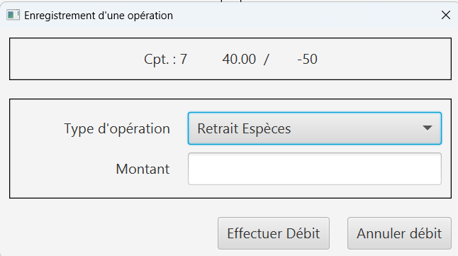

= *Document Utilisateur V2 - SAÉ 2.01/2.05*
:toc:
:toc-title: Sommaire
:title-page:
:sectnums:
:title-logo-image: image:img/Logo_IUT_Blagnac.png[]
:stem: asciimath

image::../img/Logo_IUT_Blagnac.png[]

.Equipe :

. Tanguy Picuira
. Emilien Fieu
. Vincent Barette

Version 1.0, 16 Mai 2023, Groupe 3B1

== Daily Bank

=== Présentation de l'application

Daily Bank est une application de gestion de compte bancaire. Elle permet de gérer ses comptes bancaires, de faire des virements, de gérer ses prêts et de gérer ses comptes.

=== Installation

* Pour pouvoir lancer l'application, il faut avant tout avoir Java d'installé sur son ordinateur.
* Pour installer Java, il faut se rendre sur le site de Java et télécharger la dernière version de Java.
* Une fois Java installé, il faut double cliquer sur le .jar fournit avec l'application. L'application se lance alors.
* Il faut ensuite disposer d'un identifiant et d'un mot de passe guichetier ou chef d'Agence pour avoir accès à l'application.
* Une fois connecté, l'application est prête à être utilisée.

=== Utilisation

Lorsqu'on est connecté, on arrive sur la page d'accueil de l'application. Cette page permet de naviguer dans l'application et d'accéder aux différentes fonctionnalités.

[discrete]
=== Accueil

image::../img/AccueilDailyBank.png[]

On a les informations de l'utilisateur connecté et de son agence. Ensuite, nous avons une barre de menu qui permet de naviguer dans l'application.

[discrete]
=== Barre de menu

image::../img/BarreMenu.png[]

Dans cette barre, nous avons les onglets suivants : Utilisateur, qui permet de se connecter si ce n'est pas déjà fait, de se déconnecter et enfin de quitter l'application.

[discrete]
=== Gestions

image::../img/Gestion.png[]

Ensuite, nous avons l'onglet Gestion qui permet d'avoir accès aux clients et les comptes et si l'utilisateur est un chef d'agence, il a accès aux employés de l'agence.

[discrete]
=== Aide

image::../img/Aide.png[]

Enfin, il y a un onglet aide qui donne des informations sur l'application.

=== Fonctionnalités

[discrete]
=== Accueil Gestions

C'est dans l'espace Gestion: Clients que l'on peut gérer les différents clients de l'Agence. On peut ajouter un client, le ou le supprimer. On peut aussi rechercher un client par son nom ou son prénom.

[discrete]
=== Clients et comptes

Après avoir cliqué sur Rechercher, nous avons la liste des clients qui apparait. On peut alors sélectionner un client et voir ses comptes avec le bouton Comptes client.

On peut donc gérer les comptes du client selectionné. On peut ajouter un compte ou le supprimer si le solde est à zéro et voir les opérations effectuées sur le compte.

image::../img/Operations.png[]

On peut alors ajouter un débit sur le compte.

[discrete]
=== Gestion des employés

image::../img/Employe.png[]

Si l'utilisateur est un chef d'agence, il a accès à l'onglet Gestion: Employés. Il peut alors ajouter un employé, le supprimer ou le rechercher par son nom ou son prénom.

image::../img/AjoutEmploye.png[]

Pour ajouter un employé, il faut remplir correctement les champs et cliquer sur Créer.

image::../img/ModifEmploye.png[]

Pour modifier un employé, il faut sélectionner un employé et cliquer sur Modifier. On peut alors modifier les informations de l'employé.

[discrete]
=== Débit, Crédit & Virement

__Depuis le menu "Gestion des opérations" d'un compte DailyBank actif, le guichetier peut effectuer des opérations affectant le solde des comptes bancaires.__

image::../img/Employe.png[]

[discrete]
==== Débit

Le guichetier peut effectuer un débit sur un compte en utilisant le bouton "Enregistrer Débit". Il pourra ensuite saisir un montant ainsi qu'un motif pour l'opération, et confirmer la transaction.

[discrete]
==== Crédit

Le guichetier peut effectuer un crédit sur un compte en utilisant le bouton "Enregistrer Crédit". Il pourra ensuite saisir un montant ainsi qu'un motif pour l'opération, et confirmer la transaction.

image::../img/DocUtil/Credit.png[]

[discrete]
==== Virement

Le guichetier peut effectuer un virement d'un compte à un autre, en utilisant le bouton "Enregistrer Virement". Il pourra ensuite saisir un montant ainsi que le bénéficiaire de la somme, et confirmer la transaction.

[discrete]
=== Gestion des prélèvements automatiques

__Depuis le menu "Gestion des prélèvements" d'un compte DailyBank actif, le guichetier peut créer, lire, modifier ou supprimer ses prélèvements automatiques.__

[discrete]
==== Recherche & Lecture

Cliquer sur le bouton **Rechercher** permet d'afficher la liste des prélèvements automatiques associés au compte DailyBank. Il est également possible de chercher un prélèvement automatique en particulier en renseignant son identifiant dans le champ de recherche.

image::../img/DocUtil/CRUDP/Rechercher.png[]

[discrete]
==== Création

Cliquer sur le bouton **Nouveau prélèvement** ouvrira une fenêtre permettant de créer un nouveau prélèvement automatique. Il est nécessaire de renseigner le montant du prélèvement, la date récurrente, le motif du prélèvement ainsi que le compte bénéficiaire du prélèvement.

image::../img/AjoutEmploye.png[]

Pour ajouter un employé, il faut remplir correctement les champs et cliquer sur Créer.

image::../img/ModifEmploye.png[]

Pour modifier un employé, il faut sélectionner un employé et cliquer sur Modifier. On peut alors modifier les informations de l'employé.