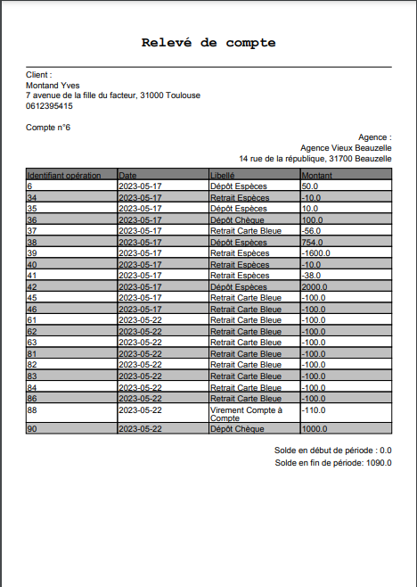

= *Document Utilisateur V2 - SAÉ 2.01/2.05*
:toc:
:toc-title: Sommaire
:toclevels: 3
:title-page:
:sectnums:
:title-logo-image: image:img/Logo_IUT_Blagnac.png[]
:stem: asciimath

.Equipe :

. Tanguy Picuira
. Emilien Fieu
. Vincent Barette

Version 1.0, 16 Mai 2023, Groupe 3B1

== Daily Bank

=== Présentation de l'application

Daily Bank est une application de gestion de compte bancaire. Elle permet de gérer ses comptes bancaires, de faire des virements, de gérer ses prêts et de gérer ses comptes.

=== Installation

* Pour pouvoir lancer l'application, il faut avant tout avoir Java d'installé sur son ordinateur.
* Pour installer Java, il faut se rendre sur le site de Java et télécharger la dernière version de Java.
* Une fois Java installé, il faut double cliquer sur le .jar fournit avec l'application. L'application se lance alors.
* Il faut ensuite disposer d'un identifiant et d'un mot de passe guichetier ou chef d'Agence pour avoir accès à l'application.
* Une fois connecté, l'application est prête à être utilisée.

=== Utilisation

Lorsqu'on est connecté, on arrive sur la page d'accueil de l'application. Cette page permet de naviguer dans l'application et d'accéder aux différentes fonctionnalités.

==== Accueil

On a les informations de l'utilisateur connecté et de son agence. Ensuite, nous avons une barre de menu qui permet de naviguer dans l'application.

==== Barre de menu

Dans cette barre, nous avons les onglets suivants : Utilisateur, qui permet de se connecter si ce n'est pas déjà fait, de se déconnecter et enfin de quitter l'application.

==== Gestions

Ensuite, nous avons l'onglet Gestion qui permet d'avoir accès aux clients et les comptes et si l'utilisateur est un chef d'agence, il a accès aux employés de l'agence.

==== Aide

Enfin, il y a un onglet aide qui donne des informations sur l'application.

=== Fonctionnalités

==== Accueil Gestions

image::../img/Clients.png[]

C'est dans l'espace Gestion: Clients que l'on peut gérer les différents clients de l'Agence. On peut ajouter un client, le ou le supprimer. On peut aussi rechercher un client par son nom ou son prénom.

==== Clients et comptes

image::../img/ComptesRecherche.png[]

Après avoir cliqué sur Rechercher, nous avons la liste des clients qui apparait. On peut alors sélectionner un client et voir ses comptes avec le bouton Comptes client.

image::../img/ComptesClient.png[]

On peut donc gérer les comptes du client selectionné. On peut ajouter un compte ou le supprimer si le solde est à zéro et voir les opérations effectuées sur le compte.

image::../img/Debit.png[]

On peut alors ajouter un débit sur le compte.

==== Gestion des employés (E)

Si l'utilisateur est un chef d'agence, il a accès à la page « Gestion des Employés »

.Page Gestion des employés
image::../img/DocUtil/CRUDE/PageEmploye.png[]

===== Création d'un employé (E)

**Étape 1 :**Pour créer un employé, il faut cliquer sur le bouton « Nouvel employé ».

.Le Bouton Nouvel employé est ici encadré en rouge
image::../img/DocUtil/CRUDE/Employe.png[]

**Étape 2 :**Vous pouvez ensuite remplir tout les champs dans la fenettre qui s'ouvre. Les champs disponibles sont les suivants :

* Nom
* Prénom
* Droits d’accès
* Login
* Mot de passe

Vous pouvez ensuite cliquer sur le bouton valider pour créer l'employé.

.Les champs à remplir sont soulignés en rouge et le bouton valider est encadré en rouge

===== Modification d'un employé (E)
Pour modifier un employé, il faut sélectionner un employé dans la liste d’employé de l’agence et cliquer sur Modifier.

.La liste des employés est encadrée en Orange et le bouton Modifier est encadré en rouge

Une page s’ouvre alors avec les informations de l’employé. Vous pouvez alors modifier les informations de l’employé et cliquer sur le bouton « Modifier » pour enregistrer les modifications.

.Le bouton Modifier est encadré en rouge
image::../img/DocUtil/CRUDE/ModifEmploye.png[]

===== Recherche d’un employé (E)

Pour rechercher un employé, vous avez pouvez soit rechercher par numéro d’employé, soit rechercher par nom et prénom.

Pour la recherche par numéro d’employé, il faut entrer le numéro d’employé dans le champ « Numéro » et cliquer sur le bouton « Rechercher ».

Pour la recherche par nom et prénom, il faut entrer au moins le début du nom, si vous connaissez le prénom, vous pouvez aussi l’entrer. Ensuite, il faut cliquer sur le bouton « Rechercher ».

.Les champs à remplir pour la recherche par numéro d’employé sont encadrés en orange, les champs à remplir pour la recherche par nom et prénom sont encadrés en vert et le bouton Rechercher est encadré en rouge

===== Suppression d’un employé (E)

Pour supprimer un employé, il faut sélectionner un employé dans la liste d’employé de l’agence et cliquer sur Supprimer.

.La liste des employés est encadrée en Orange et le bouton Supprimer est encadré en rouge

Vous devez ensuite confirmer la suppression de l’employé en cliquant sur le bouton « Ok » ou annuler la suppression en cliquant sur le bouton « Annule ».

.Le bouton Ok est encadré en vert et le bouton Annuler est encadré en rouge

==== Relevé PDF (E)

Les guichetier ont la possibilité de généerer des relevés bancaires au format PDF pour les comptes des clients de l'agence. Pour cela, il suffit de sélectionner un comptes dans la liste des comptes du client, puis de cliquer sur le bouton « Relevé PDF ».

.La liste des clients est encadrée en orange et le bouton Comptes Client est encadré en rouge

Une fenêtre s'ouvre alors, vous pouvez alors choisir le mois et l'année du relevé, puis cliquer sur le bouton « Ok » pour générer le relevé.

.Les champs à remplir sont souligné en rouge et le bouton Ok est encadré en rouge

Une fenetre s’ouvre ensuite pour vous permettre de choisir l’emplacement du fichier PDF. Vous pouvez alors choisir l’emplacement et le nom du fichier PDF, puis cliquer sur le bouton « Enregistrer » pour enregistrer le fichier PDF. (L’aspect de cette fenettre changera en fonction de votre système d’exploitation)

Une fenetre s’ouvrira alors pour vous indiquer que le fichier PDF a bien été enregistré. Vous pouvez alors cliquer sur le bouton « Ok » pour fermer la fenetre.

.Le bouton « Ok » est encadré en rouge
image::../img/DocUtil/RelevePDF/RéussiteReleve.png[]

Le fichier PDF est alors enregistré à l’emplacement que vous avez choisi. Vous pouvez alors l’ouvrir pour voir le relevé.

.Exemple de relevé de compte

===== Relevés automatiques (E)
Lorsque vous lancez l’application, elle va vérifier si vous avez déja les relevés du mois courant. Si ce n’est pas le cas, elle va alors générer les relevés pour tous les comptes de l’agence. Vous pouvez alors voir les relevés dans le dossier « Releve » de l’application.

==== Débit, Crédit & Virement

__Depuis le menu "Gestion des opérations" d'un compte DailyBank actif, le guichetier peut effectuer des opérations affectant le solde des comptes bancaires.__

image::../img/Employe.png[]

===== Débit (V)

Le guichetier peut effectuer un débit sur un compte en utilisant le bouton "Enregistrer Débit". Il pourra ensuite saisir un montant ainsi qu'un motif pour l'opération, et confirmer la transaction.

image::../img/DocUtil/Debit.png[]

===== Débite Exceptionnel (E)

Dans le cas ou le débit dépasse la limite de découvert du compte, si l’employé est un chef d’agence il peut effectuer un débit exceptionnel sur un compte en validant la fenêtre d’avertissement qui s’ouvre après avoir cliqué sur le bouton « Effectuer Débit ».

.La fenêtre d’avertissement pour valider le débit exceptionnel

===== Crédit (V)

Le guichetier peut effectuer un crédit sur un compte en utilisant le bouton "Enregistrer Crédit". Il pourra ensuite saisir un montant ainsi qu'un motif pour l'opération, et confirmer la transaction.

===== Virement (V)

Le guichetier peut effectuer un virement d'un compte à un autre, en utilisant le bouton "Enregistrer Virement". Il pourra ensuite saisir un montant ainsi que le bénéficiaire de la somme, et confirmer la transaction.

image::../img/DocUtil/Virement.png[]

==== Gestion des prélèvements automatiques

__Depuis le menu "Gestion des prélèvements" d'un compte DailyBank actif, le guichetier peut créer, lire, modifier ou supprimer ses prélèvements automatiques.__

===== Recherche & Lecture (V)

Cliquer sur le bouton **Rechercher** permet d'afficher la liste des prélèvements automatiques associés au compte DailyBank. Il est également possible de chercher un prélèvement automatique en particulier en renseignant son identifiant dans le champ de recherche.

===== Création (V)

Cliquer sur le bouton **Nouveau prélèvement** ouvrira une fenêtre permettant de créer un nouveau prélèvement automatique. Il est nécessaire de renseigner le montant du prélèvement, la date récurrente, le motif du prélèvement ainsi que le compte bénéficiaire des futures transactions.

Le champ **Date Recurrente** correspond au jour du mois où les futurs prélèvements seront effectués. Par exemple, si le champ est renseigné avec la valeur 3, le prélèvement sera effectué le 3 de chaque mois.

===== Mise à jour (V)

La modification d'un virement s'effectue en selectionnant un virement dans la liste des virements et en cliquant sur le bouton **Modifier prélèvement**. Il est alors possible de modifier le montant du prélèvement, la date récurrente, le motif du prélèvement ainsi que le compte bénéficiaire des futures transactions.

===== Suppression (V)

La suppression d'un virement s'effectue en selectionnant un virement dans la liste des virements et en cliquant sur le bouton **Supprimer prélèvement**. Il vous sera demandé de confirmer l'action.

